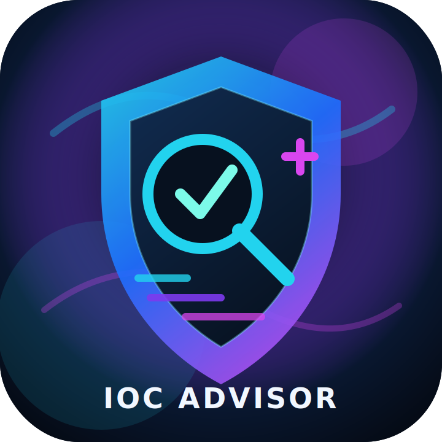
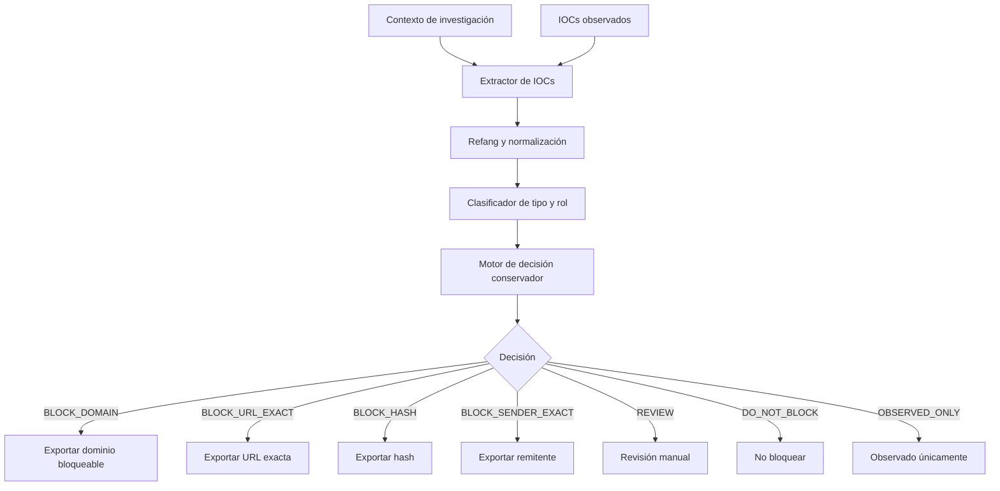

<p align="center">
  
</p>


<h1 align="center">IOC OSINT Block Advisor</h1>

<p align="center">
  <strong>Herramienta local para analistas SOC orientada al análisis OSINT y recomendación conservadora de bloqueo de IOCs.</strong>
</p>

<p align="center">
  <em>IOC observado no significa IOC bloqueable.</em>
</p>

<p align="center">
  
  
  
  
</p>

---

## 🛡️ Qué es

**IOC OSINT Block Advisor** es una utilidad local en **Python 3.11 + Tkinter** diseñada para ayudar a analistas SOC durante investigaciones de **phishing**, **malware** o abuso de infraestructura.

La herramienta permite pegar contexto de investigación e IOCs observados, analizarlos, clasificarlos y generar recomendaciones justificadas.

> La herramienta **no bloquea automáticamente ningún IOC**.  
> Solo ayuda al analista a decidir qué debe bloquearse, qué debe revisarse y qué no debe bloquearse.

---

## 🎯 Principio principal

> **IOC observado no significa IOC bloqueable.**

Este proyecto nace para evitar errores operativos habituales en investigaciones SOC, por ejemplo:

- bloquear un dominio SaaS legítimo solo porque apareció en una cadena de phishing;
- bloquear un remitente legítimo usado por una plataforma real;
- bloquear dominios raíz legítimos cuando solo una URL concreta fue abusada;
- exportar indicadores dudosos como si fueran bloqueables.

La herramienta aplica una lógica conservadora: **mejor revisar que bloquear mal**.

---

## ✨ Funcionalidades destacadas

- 🧠 Clasificación conservadora de IOCs.
- 🖥️ Interfaz gráfica local tipo dashboard SOC.
- 🎨 UI moderna con estilo oscuro aurora/neón.
- 🔍 Análisis de dominios, URLs, emails, IPs y hashes.
- 🧩 Diferenciación entre infraestructura legítima y destino malicioso.
- 🧯 Evita falsos positivos en dominios SaaS conocidos.
- 🔗 Detección de URLs exactas abusadas.
- 🏁 Identificación de landings finales de phishing.
- 🧾 Generación de resumen para tickets SOC/Jira.
- 📋 Botón para copiar IOC observado.
- 🛡️ Botón para copiar únicamente el valor realmente bloqueable.
- 📤 Exportación de blocklists separadas.
- 🧪 Tests unitarios incluidos.
- 🔒 OSINT externo opcional y deshabilitado por defecto.

---

## 🧭 Flujo de análisis



---

## 🧠 Decisiones soportadas

| Decisión | Significado | ¿Se exporta a blocklist? |
|---|---|---:|
| `BLOCK_DOMAIN` | Dominio con evidencia suficiente para bloqueo | ✅ |
| `BLOCK_URL_EXACT` | URL concreta abusada, sin bloquear el dominio completo | ✅ |
| `BLOCK_SENDER_EXACT` | Remitente exacto con evidencia fuerte | ✅ |
| `BLOCK_HASH` | Hash malicioso o de alta confianza | ✅ |
| `REVIEW` | Requiere revisión manual del analista | ❌ |
| `DO_NOT_BLOCK` | No bloquear, normalmente infraestructura legítima | ❌ |
| `OBSERVED_ONLY` | IOC observado sin evidencia suficiente | ❌ |

Solo se exportan indicadores con decisión:

```text
BLOCK_DOMAIN
BLOCK_URL_EXACT
BLOCK_SENDER_EXACT
BLOCK_HASH
```

Nunca se exportan como bloqueables:

```text
REVIEW
DO_NOT_BLOCK
OBSERVED_ONLY
```

---

## 🧪 Ejemplo de criterio conservador

### Caso: infraestructura legítima usada en una cadena de phishing

| IOC observado | Interpretación | Decisión esperada |
|---|---|---|
| `events.zoom.us` | Plataforma legítima observada | `REVIEW` o `BLOCK_URL_EXACT` si aplica a una URL concreta |
| `meta.highspot.com` | SaaS legítimo observado | `REVIEW` |
| `login-workportal-sso.example` | Landing final de phishing | `BLOCK_DOMAIN` |
| `noreply-zoomevents@zoom.us` | Remitente legítimo observado | `DO_NOT_BLOCK` |
| `sender@example.org` | Sender sospechoso sin evidencia fuerte | `REVIEW` |

### Regla práctica

- Si el IOC pertenece a una plataforma legítima, no bloquear el dominio completo.
- Si solo una URL concreta fue abusada, priorizar `BLOCK_URL_EXACT`.
- Si es una landing final de phishing con suplantación y credenciales, recomendar `BLOCK_DOMAIN`.
- Un sender observado no se bloquea por defecto.

---

## 🖥️ Interfaz

La aplicación incluye:

- caja de contexto de investigación;
- caja de IOCs observados;
- resumen ejecutivo;
- tabla de resultados coloreada por decisión;
- detalle dinámico del IOC seleccionado;
- valor para bloqueo visible;
- acciones rápidas para copiar;
- exportación de resultados;
- barra de estado con la regla principal.

### Acciones rápidas

| Acción | Uso |
|---|---|
| `Copiar IOC` | Copia el IOC normalizado observado |
| `Copiar para bloqueo` | Copia solo el valor bloqueable si la decisión lo permite |
| `Copiar resumen para ticket` | Copia una explicación breve para pegar en Jira/ticket |

---

## 📦 Estructura del proyecto

```text
ioc_osint_block_advisor/
├── main.py
├── modules/
│   ├── fang.py
│   ├── extractor.py
│   ├── classifier.py
│   ├── decision_engine.py
│   ├── exporter.py
│   ├── osint_runner.py
│   └── utils.py
├── config/
│   ├── allowlist_domains.txt
│   ├── trusted_saas_domains.txt
│   └── suspicious_keywords.txt
├── output/
│   └── .gitkeep
└── tests/
    ├── test_fang.py
    ├── test_extractor.py
    └── test_defanged_parse_regression.py
```

---

## ⚙️ Instalación

### Requisitos

- Windows, Linux o macOS.
- Python 3.11 recomendado.
- Git opcional para clonar el repositorio.

### Clonar el repositorio

```powershell
git clone https://github.com/U7Dani/IOC-OSINT-Block-Advisor.git
cd IOC-OSINT-Block-Advisor\ioc_osint_block_advisor
```

### Crear entorno virtual en Windows

```powershell
py -3.11 -m venv .venv
.\.venv\Scripts\activate
py -m pip install -r requirements.txt
```

### Ejecutar la aplicación

```powershell
py main.py
```

También puedes ejecutarla usando el Python del entorno virtual:

```powershell
.\.venv\Scripts\python.exe main.py
```

---

## ✅ Validación

Desde la carpeta de la aplicación:

```powershell
py -m py_compile main.py
py -m pytest
```

Resultado esperado en la versión `v1.0.0`:

```text
19 passed
```

---

## 🔍 Fuentes OSINT soportadas

La herramienta contempla fuentes OSINT gratuitas y opcionales como:

- DNS
- RDAP
- crt.sh
- URLHaus
- ThreatFox
- MalwareBazaar
- PhishTank
- AlienVault OTX
- urlscan

### Privacidad

Las consultas OSINT externas están **deshabilitadas por defecto**.

La herramienta está diseñada para no exponer IOCs sensibles de una investigación a terceros salvo que el analista lo active explícitamente.

> Importante: nunca enviar automáticamente URLs a urlscan ni a servicios externos sin decisión consciente del analista.

---

## 📤 Exportaciones generadas

La herramienta genera salidas separadas para facilitar el trabajo SOC:

```text
output/
├── blocklist_domains.txt
├── blocklist_urls.txt
├── blocklist_senders.txt
├── blocklist_hashes.txt
├── review_items.csv
├── full_report.md
└── ticket_summary.txt
```

### Regla de exportación

Las blocklists solo contienen IOCs con decisión bloqueable:

```text
BLOCK_DOMAIN
BLOCK_URL_EXACT
BLOCK_SENDER_EXACT
BLOCK_HASH
```

Los elementos en revisión o no bloqueables quedan documentados en reportes, pero no se exportan como bloqueo.

---

## 🔒 Seguridad operacional

Este proyecto evita por diseño:

- bloqueo automático de indicadores;
- envío automático de URLs a terceros;
- exportación de IOCs dudosos como bloqueables;
- bloqueo de dominios SaaS legítimos por abuso puntual;
- bloqueo de remitentes legítimos solo por aparecer en una campaña.

### Buenas prácticas

Antes de aplicar cualquier bloqueo:

1. revisar el contexto;
2. verificar si el IOC es infraestructura legítima;
3. confirmar si se debe bloquear dominio, URL exacta, remitente o hash;
4. validar el riesgo de falso positivo;
5. documentar la decisión en ticket.

---

## 🧰 Casos de uso SOC

- Investigación de phishing.
- Análisis de cadenas de redirección.
- Separación entre infraestructura legítima y landing final.
- Revisión de remitentes observados.
- Preparación de bloqueos manuales.
- Generación de resumen para Jira o sistema de tickets.
- Documentación de IOCs observados pero no bloqueables.

---

## 🛣️ Roadmap

Mejoras previstas:

- mejorar detección de cadenas de redirección;
- ampliar fuentes OSINT gratuitas;
- enriquecer scoring conservador;
- mejorar informe SOC para tickets;
- añadir más pruebas unitarias;
- mejorar gestión de allowlists;
- empaquetado ejecutable para Windows;
- documentación visual con capturas limpias de laboratorio.

No forman parte del objetivo inmediato:

- bloqueo automático;
- integración directa con firewalls, proxy, EDR o SIEM;
- envío automático de IOCs a terceros;
- decisiones agresivas de bloqueo sin evidencia.

---

## 🧪 Filosofía de diseño

La herramienta está pensada para el trabajo diario de un analista SOC:

- rápida;
- local;
- clara;
- conservadora;
- explicable;
- útil para tickets;
- segura frente a falsos positivos.

> Bloquear mal puede romper negocio.  
> Revisar de más cuesta tiempo.  
> Esta herramienta prioriza justificar cada recomendación.

---

## ⚠️ Disclaimer

IOC OSINT Block Advisor es una herramienta de apoyo al análisis.

Las recomendaciones generadas deben ser revisadas por un analista antes de aplicar cualquier acción de bloqueo en entornos productivos.

El autor no se hace responsable del uso indebido, bloqueos incorrectos o decisiones automáticas tomadas fuera de la herramienta.

---

## 📄 Licencia

Consulta el archivo `LICENSE` del repositorio.

---

<p align="center">
  <strong>IOC OSINT Block Advisor</strong><br>
  <em>Observed IOC does not mean blockable IOC.</em>
</p>
